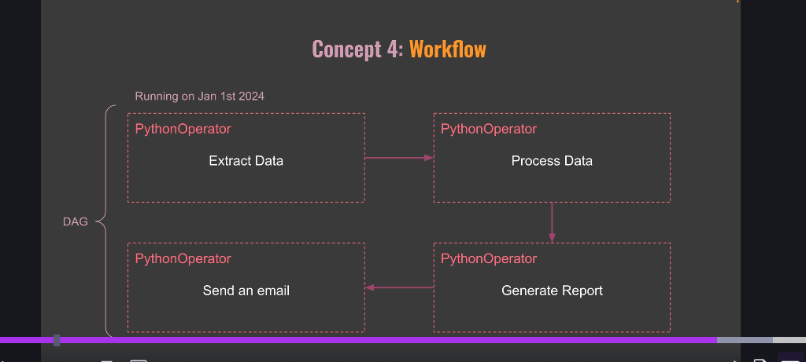

# Key components of Airflow include:
## Component	Description
### 1) DAG: Like a receipe
Defines the workflow; each DAG file describes a complete workflow in proper sequence.

### 2) Task:Acutal execution
A single unit of work in the DAG; tasks can be executed in parallel depending on dependencies.

### 3) Operator:Thousands of operators in Airflow
Defines the kind of work that will be done by a task; examples include BashOperator, PythonOperator, etc.

### 4) Scheduler:
Responsible for triggering the tasks based on the specified schedule and dependencies.

### 5) Executor:
Defines how tasks are executed; options include LocalExecutor, CeleryExecutor, and DaskExecutor. Executor are part of Scheduler

### 6) The API Server(Web UI): Dashboard in your car.
Provides a graphical interface to monitor the state of tasks and DAGs, view logs, and manage workflows.
API Server provides endpoints for task operations and serving the UI

### 7) Workers: Chefs in Kitchen
Workeres are processes that actually perform the tasks.
They do actual work defined in your tasks.

### 8) Queue

### 9) Triggerer:

### 10) Workflow:
Entier process defined by your DAG, including all tasks and their dependencies.
Ex.Daily Sales Report, which includes tasks for exracting sales data, processing it, generating a report and email to ops.

